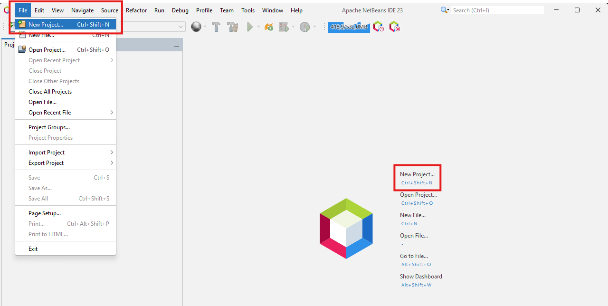
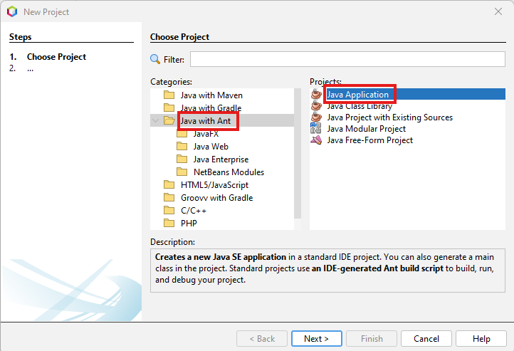
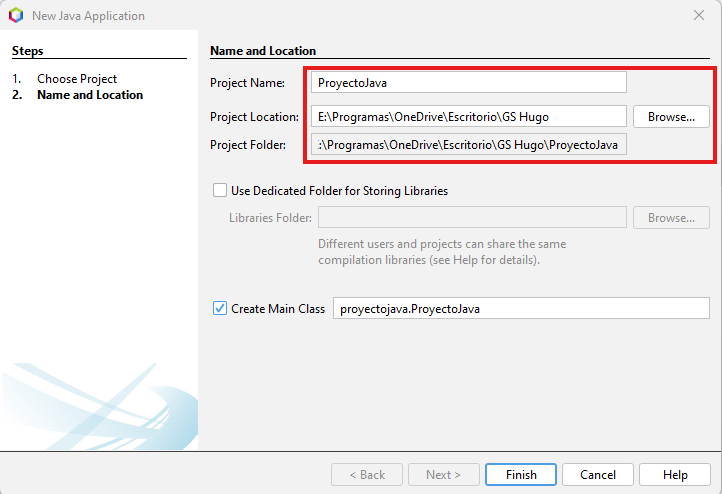
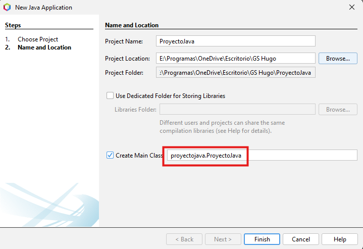

# ¿Comó creamos un proyecto en NetBeans?
Ahora vamos a mostrarte paso a paso como crear un proyecto con este IDE, incluyendo sus configuraciónes básicas a la hora de crearlo.

### Paso 1

#### Opción 'New Project...'
Una vez tengamos NetBeans instalado y abierto en el equipo deberemos, buscar la opción '*New Project...*' en la pestaña *File*, darle click
en el menú interactivo del centro de la ventana o usar el atajo de teclado 'Ctrl+Shift+N'.

### Paso 2

#### Seleccionar tipo de proyecto
Después de haber accedido al apartado de Nuevo Proyecto, tendremos que seleccionar el tipo de proyecto que queramos, incluyendo
en algunos casos el lenguaje de programación que queremos usar.

En nuestro caso vamos a utilizar la opción 'Java with Ant' > 'Java Application', la cuál es la más común y sencilla para Java.

### Paso 3

#### Nombre y ubicación del proyecto
En la siguiente pestaña encontraremos los apartados '*Project name*' (nombre del proyecto), '*Project Location*' (localización 
del proyecto) y '*Project folder*' (carpeta del proyecto). Para cambiar los respectivos parámetros en las dos primeras opciones
, y para visualizar como sería la ruta en la última opción. 

Además de la opción '*Create Main Class*' que permite cambiar el nombre del *package* del proyecto (texto antes del punto)
y el nombre de la clase del proyecto (texto después del punto).

### Finish
Después del paso anterior ya estaría el proyecto creado y listo para configurarlo en los próximos pasos de este manual de uso.