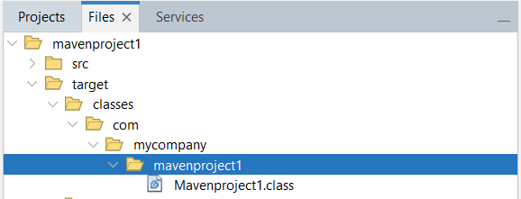
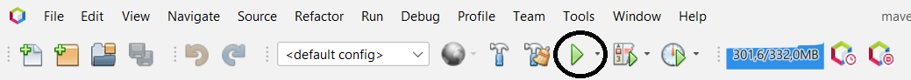

# 3. Aprender a manejar NetBeans

### 3.1 Configuración básica

3.1.1 JDK

* Tools -> Java Platforms -> Add platform
* En el apartado izquierdo vamos a "Projects -> Propierties del Proyecto -> Libraries"

##### Netbeans 23, necesita JDK 17+

3.1.2 Compilados

* En el apartado "Files" abre el árbol de archivos del proyecto, y en una carpeta llamado igual que el proyecto aparecen
los alchivos compilados.

3.1.3 Carpeta Test

* En el apartado "Projects". Clic derecho sobre el archivo del proyecto. Luego, darle a New > Java Class.
Y en el campo Package de la ventana emergente, escribe “test” para crear la carpeta de test.

3.1.4 Librerías, dependecias

* Tools -> Libraries

    Para añadir un Classpath hacer click en "Add JAR/Folder"
* Projects -> Dependencies

    Para añadir Classpath o Modulepath haz click en el "+" de la derecha y "Add JAR/Folder"

### 3.2 Ejecutar un programa

Formas de ejecutar un programa

##### Para ejecutar un programa en netbeans existen varias opciones: 

* Botón de run Project.
* Pestaña Run -> Run project
* Pestaña Run -> Run File
* F6 -> Run Project
* Mayús + F6 -> Run File

### 3.3 Debug en netbeans

Como hacer Debug

Clicar el número de línea en el que queramos establecer un breakpoint, siempre y cuando sea posible ponerlo.
##### Al hacer click derecho sobre el punto rojo que representa el breakpoint -> Properties, se pueden añadir condiciones y otros parámetros.

* Debug Project -> Botón Debug | Crtl + F5 | Debug -> Debug Project
* Debug File -> Debug -> Debug File | Crtl + Mayús + F5
* Debug Test File -> Debug Test File | Crtl + Mayús + F6
* Step over -> F8
* Step over expression -> Mayús + F8
* Step Into -> F7
* Step out -> Crtl + F7

##### Al hacer debug, se creará una nueva ventana debajo de Navigator, dónde se verán todos los breakpoints. Y se podrán modificar y crear nuevos.

### 3.4 Atajos de teclado

Algunos atajos de teclado

* Ctrl + Espacio -> Sugerencias de código

* Ctrl + Shift + I -> Realizar importaciones automáticas de librerías necesarias

* Ctrl + E -> Eliminar la línea actual.

* Alt + Shift + F -> Organizar código.

* Ctrl + Shift + U -> Crear test.

* Ctrl + Shift + D -> Acceder a las últimas cinco copias del portapapeles.

* Ctrl + Shift + C -> Comentar línea seleccionada.

* Shift + Suprimir -> Cortar línea actual.

* Ctrl + K -> Autocompletar código.

* for + Tabulador -> Insertar un bucle for.

* Ctrl + Shift + Flecha Abajo -> Duplicar línea seleccionada.

* Ctrl + 4 -> Mostrar output (consola de salida).

* Ctrl + Shift + R -> Selección rectangular.

### 3.5 Ventana de estrucura .java

Ventana Navigator

##### La ventana de estructura esta por defecto en la esquina inferior izquierda.

* Pestaña "Window" -> Navigator
* Ctrl + 7
    
    Después de abrir la ventana puede ser que no te aparezca la vista de ningún archivo debes clicar un archivo .java, 
para que te aparezca la vista sobre ese proyecto.

