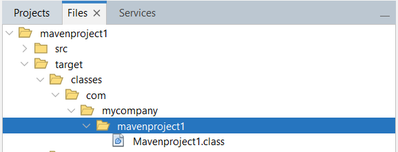
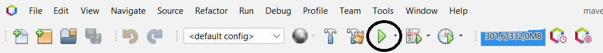

Hola aSDIOS

Or **try Docusaurus immediately** with **[docusaurus.new](https://docusaurus.new)**.

### What you'll need

- [Node.js](https://nodejs.org/en/download/) version 18.0 or above:
  - When installing Node.js, you are recommended to check all checkboxes related to dependencies.

## Generate a new site

Generate a new Docusaurus site using the **classic template**.

The classic template will automatically be added to your project after you run the command:

```bash
npm init docusaurus@latest my-website classic
```

You can type this command into Command Prompt, Powershell, Terminal, or any other integrated terminal of your code editor.

The command also installs all necessary dependencies you need to run Docusaurus.

## Start your site

Run the development server:

```bash
cd my-website
npm run start
```

The `cd` command changes the directory you're working with. In order to work with your newly created Docusaurus site, you'll need to navigate the terminal there.

The `npm run start` command builds your website locally and serves it through a development server, ready for you to view at http://localhost:3000/.

Open `docs/intro.md` (this page) and edit some lines: the site **reloads automatically** and displays your changes.

# 4. Aprender a manejar netbeans

## 4.1 Configuración básica

<details>
<summary>JDK</summary>

* Tools -> Java Platforms
* Projects -> Java Dependecies
* Tools -> Java Platforms -> Add platform

### Netbeans 23, necesita JDK 17+

</details>

<details>
<summary>Compilados</summary>



</details>

<details>
<summary>Carpeta Test</summary>

* Clic derecho en el nombre del proyecto.New > Java Class.
En el campo Package, escribe “test” para crear la carpeta de test.


</details>

<details>
<summary>Librerías, dependecias</summary>

* Tools -> Libraries
* Projects -> Dependencies

</details>

## 4.1.2 Ejecutar un programa

<details>
<summary>4.1.2 Formas de ejecutar un programa</summary>

### Para ejecutar un programa en netbeans existen varias opciones: 

* Botón de run Project.
* Pestaña Run -> Run project
* Pestaña Run -> Run File
* F6 -> Run Project
* Mayús + F6 -> Run File



</details>

### 4.1.3 Debug en netbeans

### 4.1.4 Atajos de teclado

<details>
<summary>Algunos atajos de teclado</summary>

* Ctrl + Espacio -> Sugerencias de código

* Ctrl + Shift + I -> Realizar importaciones automáticas de librerías necesarias

* Ctrl + E -> Eliminar la línea actual.

* Alt + Shift + F -> Organizar código.

* Ctrl + Shift + U -> Crear test.

* Ctrl + Shift + D -> Acceder a las últimas cinco copias del portapapeles.

* Ctrl + Shift + C -> Comentar línea seleccionada.

* Shift + Suprimir -> Cortar línea actual.

* Ctrl + K -> Autocompletar código.

* for + Tabulador -> Insertar un bucle for.

* Ctrl + Shift + Flecha Abajo -> Duplicar línea seleccionada.

* Ctrl + 4 -> Mostrar output (consola de salida).

* Ctrl + Shift + R -> Selección rectangular.


</details>

### 4.1.5 Ventana de estrucura .java