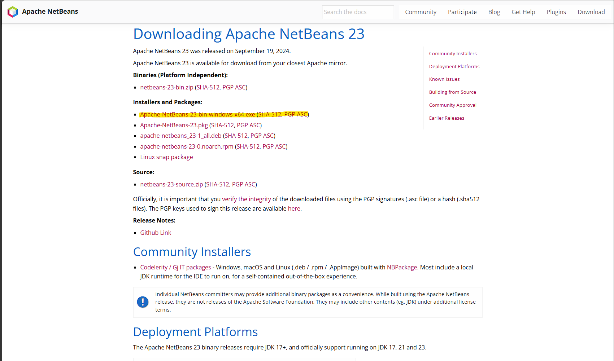
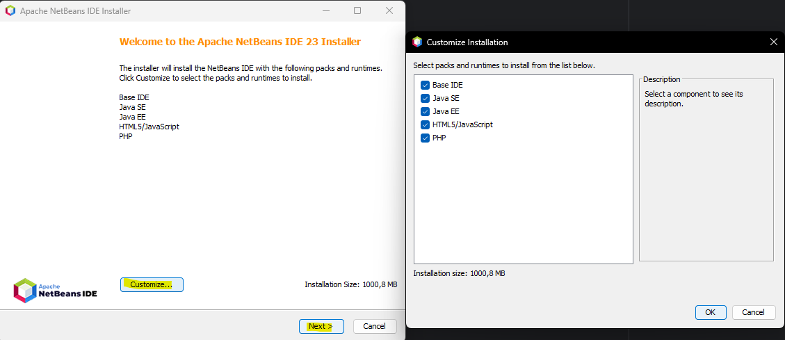
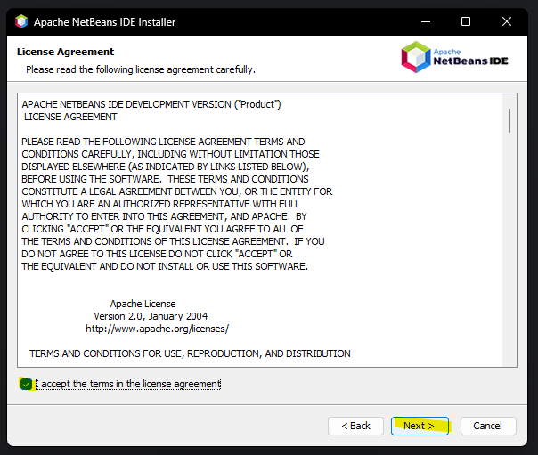
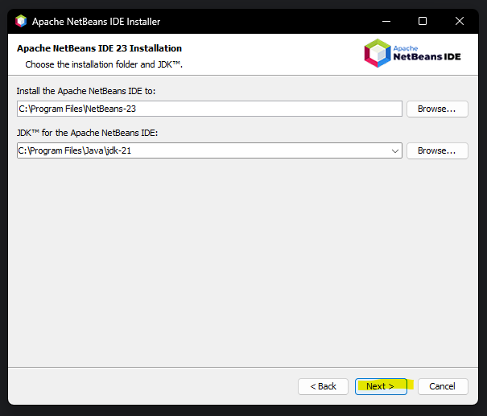
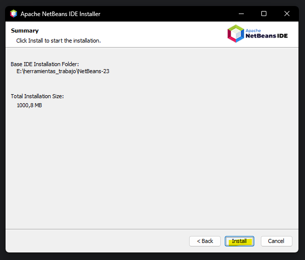

# Tutorial de instalación de NetBeans

### Paso 1

Entrar al enlace de instalación que proporcionamos:  
https://netbeans.apache.org/front/main/download/nb23/

Nos llevará al apartado de instalación en la página oficial de Apache NetBeans.  

Donde instalaremos el instalador de NetBeans con la extensión .exe.  

### Paso 2

Ejecutaremos el instalador y configuraremos la instalación.

Dándole al botón "Customize..." puedes seleccionar los packs de lenguajes que quieres instalar.

### Paso 3

Aceptar los Términos y Condiciones  

### Paso 4

Establecer la ruta en la que se quiere instalar NetBeans.  
Y establecer el JDK que se quiere utilizar.  

### Paso 5

Finalmente instalamos  
  
Y ya lo tendriamos instalado
